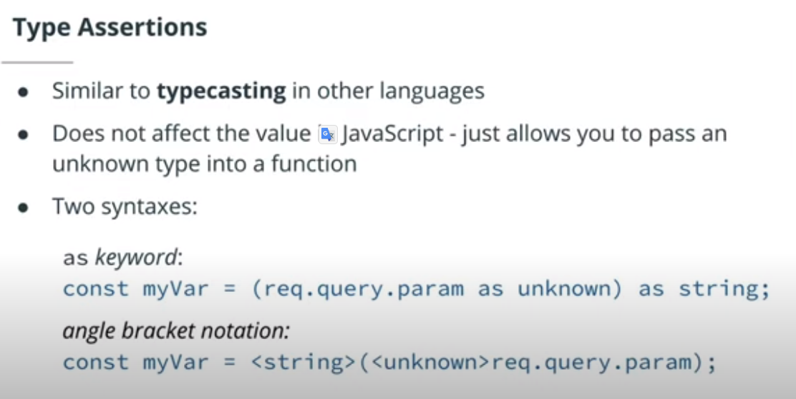
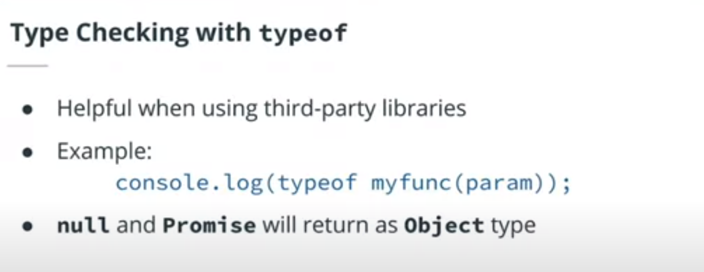

# Backend

## Definitions

- `backend` = server + application + database
- `backend functions` === data-access layer === server-side
- `The server`: the computing resource that listens to requests from the frontend
- `The application`: code that runs on the server to process requests and return responses
- `The database`: the part of the backend that is responsible for storing and organizing data
- `Stakeholder`: Any individual or group of individuals with an invested interest in something
- `Runtime`: The final phase in an application where the code is run
- `Microservice`: A piece of a larger application. In Microservice applications, the application is broken down into encapsulated microservices that can be maintained individually.
- `Monolithic Architecture`: A unified architecture where there is no separation between services or components of the application.
- `Multithreaded language`: The ability of a language to run 2 or more concurrent tasks on what are known as threads. A CPU has 2 threads. If you are on an 8 core machine, you could run 16 concurrent tasks.
- `Runtime`: A runtime is an environment that is used to interpret and run a programming language.
- `Container`: A tool used to encapsulate the entirety of an application including runtime, libraries, and files to run independently of global configurations on an operating system
- `Node Version Manager (nvm)`: A software package that allows a user to run a different version of Node.js for each project on the same machine
- `REPL` (Read, Evaluate, Print, Loop): An environment used for running programming languages
- `Byte code`: an abstraction of machine language
- `console.log`: can be used in development for logging events, but it is best practice to log to a file to save the data rather than just logging to the terminal.
- `setImmediate`: get's its own phase in the Node.js event loop which we will look at in the event loop lesson.
- `Interpreted Language`: The language is read by a runtime and executed on the spot and errors are found on execution
- `Superset`: A language that extends or builds on top of another language or standard.
- `NPM`: a command line utility form managing project's dependencies / online repository
- `dependencies`: Dependencies used in both development and production
- `devDependencies`: Dependencies that are only necessary for development
- `Node Package Manager`: (npm) A tool for managing project dependencies via command line as well as a website hosting more than 1 million third-party packages that can be used for your project
- `package-lock.json`: A JSON file that contains all of the information for the dependencies of an app's installed modules
- `package.json`: A JSON file that acts as a manifest for your project including name, author, version, description, license, dependencies, scripts, etc.
- `Prettier`: A code formatting package that can be integrated into projects to improve code consistency and readability
- `libuv`: A library written in C that provides multithreading to Node.js and allows for heavy processing.
- `microservices`: Microservices are the small services that work together.
- `Compile`: Convert code from one language to another language with a different level of abstraction. Ex. Java to Machine Code.
- `Strong-Typed`: Types are important and require declarations. Steps need to be taken to change variables to different types
- `Transpile`: Convert a language to a similarly abstracted language. Ex. ES6 to ES5
- `Weak-Typed`: Types aren't declared and in some cases mixed and concatenated.
- `npx`: node package executer
- `Self-contained application`: the application doesn't receive data from any external source
- `Access Modifier`: Used in classes to declare how a property or method can be accessed from the application
- `Duck typing`: A programming paradigm where if two or more structures (functions, interfaces, objects) have the same properties, they can be used interchangeably regardless of any type declarations
- `Enumerated type`: A set of constants that are automatically indexed and can be called by their name or index
- `Interface`: Used as a blueprint to declare the shape of something reuseable such as functions, objects, and classes
- `Tuple`: A data type of an array with a set number of values where all value types are known
- `Behavior Driven Development`: A development style built on Test Driven Development where the focus is user interaction and stakeholders.
- `Test-Driven Development`: A development style where tests are written before development
- `Host`: the ip address of the machine
- `Port`: the address of the server running on the machine
- `GraphQL`: A query language used for working with APIs
- `REST`:Representational State Transfer, a method for working with data.
- `RESTful`: Term to describe an API that is implemented following REST principles. Often used interchangeably with REST (e.g. REST/RESTful APIs).
- `Websocket API`: A type of stateful API that allows the server to know what the user is doing and vice versa

## Notes

- Process.env gives you access to the environment information of your Node.js application.
- With the use of a module like `dotenv` you can easily control your project's configuration in separate .env files based on what environment you are using (ex. production vs test vs development).
- The use of console is typically blocking (though there are some inconsistencies between versions and operating systems.
- different systems use different syntaxes for path
- A lesser-known fact is that console.log actually utilizes process.stdout in order to log to the console. (process.stdout.write())
- what is this ya brother
- package === module === dependency
- Process module relates to the global node execution process which occurs when you run a js file through Node.js
- js is single-threaded - node.js is single threaded with the ability to be Multithreaded
- node.js is an interpreter
- Libuv is the library that provides the event loop to Node.js.
- JavaScript is Weakly-Typed, This means that types are assigned by the interpreter based on the data and makes an educated guess when the code's intention is ambiguous.
- typescript is a dev dependency
- js uses the commonjs module system by default
- npx comes packaged with npm by default
- `tsconfig.json` can also be named `jsconfig.json`
- Common output directory names include dist, build, prod, and server.
- use `@types/package or @typescript/package` to download the type definitions for a package
- Debugging and refactoring are as important as writing the initial code.
- websites can have multiple services running on different ports
- it's a convention to use a 4-digit number over 1024 for port numbers
- website can have multiple services running on different ports
- `Endpoint`: An endpoint is the **_URL_** of the **_REST API_** **_with_** the method that gets, adds to, or modifies the data of an API in some way
- endpoint = the URL of the REST API + method
- endpoint = method + route
- testing endpoints = testing the method with the URL
- it's best practice to keep the server and application endpoints and functionality separate.
- With the router object, you're able to create a directory of routes and separate the functionality of each route onto its own file.
- postman is and HTTP client
- moving and renaming are the same thing in node's file system

## Process module

- events: The Process module contains the ability to perform tasks immediately before the process exits, and when it exits.
- env: gives you access to the environment information of your Node.js application.
- stdout: log to the console
- argv: allows you to pass in arguments to your application which can be a common occurrence when needing to parse data from files.
- nextTick: Allows you to run JavaScript between the different phases of the event loop.

## Path module

- path.resolve: get the absolute path from relative path
- path.normalize: normalize a path by removing dots and double slashes
- path.join: concatenate strings to create a path that works acroos operating systems

## File system

- create files
- write files
- read files
- set permissions

## Event loop

JS is single-thread

### Types of code that will be running

> there are only five types of statements in node.js

1. Synchronous
2. Timers
3. Input/Output
4. process.nextTick
5. promises

The event loop is necessary for async tasks


### The Six Phases of The Event Loop

`Timers` - executes callbacks using timers. If there are timers set to 0 ms or setImmediate(), they will run here. Incomplete timers will run in later iterations of the loop.
`Pending` - internal phase
`Idle/Prepare` - internal phase
`Poll` - process I/O callbacks
`Check` - execute any setImmediate() timers added in the Poll phase
`Close` - loop continues if there are more timers or I/O calls. If all timers and I/O calls are done, the loop closes and the process ends.

> NOTE: process.nextTick(); will always run at the end of whichever phase is called and before the next phase.

### A Bit More About the Polling Phase

The polling phase is a bit more complex than just adding to the poll queue.

`If there are no timers left to execute when the polling phase is reached`, the poll phase will wait for input/output callbacks.

`If the I/O contains synchronous code`, this code will not be added to the call stack till the polling phase is reached.

`If setImmediate() is reached`, the polling phase will end and the check phase will begin.

`If setImmediate() is not called`, the polling phase will continue to wait for a bit, and then move on through the next phases to execute additional timers and so forth.

## Best Practices for Serverside Development

- Focus on Code Quality
- Use a formatter like Prettier for syntactical consistency.
- Follow a JavaScript linting tool such as ESLint.
- Prefer ES6+ and Async/Await
- Keep Code Small
-

## Typing

- applies an attribute associated with predefined rules
- exists in most programming languages
- it's either implemented by a developer or inferred by a compiler
- there are 2 types of typing
  1. implicit: the type is inferred by the interpreter
  2. explicit: the type is declared by the developer
- It is best practice to allow TypeScript to type immutable variables and simple functions implicitly.
- Implicit Typing is a best practice when the app is self-contained (meaning that it does not depend on other applications or APIs) or variables are immutable.
- unknown is better than any
- null is typically only functionally found in union types
- any is equivalent to not using types, unknown is better
- typecasting/type assertion
  
- type checking: use `typeof` to determine the type, If you run into a situation where you have an ambiguous function, and you don't know exactly what it's doing, or you're working with a third-party library, and type definitions are missing, and you quickly want to access the type, one way of doing so is using typeof. This won't work for every type, such as null returning an object, but it will work for most.



### Types

- union types are used when data could be more than one type, often used with null or undefined subtypes
- null: the variable hasn't been declared
- undefined: the variable is declared but not defined
- void: typically a return type most of the times
- never: always a return type
- any: any type
- unknown: the type is not knowable at first (ahead of time)
- tuple: the length is fixed
- enum: used for set of predefined values

  ```ts
  enum Compass {
    "north",
    "south",
    "east",
    "west",
  }
  // use PascalCase
  ```

- type aliases/interfaces is a better way of creating objects instead of object literals
- interfaces is the preferred way to create objects
- we use PascalCase for interfaces
- factory functions is used to return new objects
- generics: reuseable components that can be used with different types
-

### Pay attention to when to use Implicit vs Explicit typing

- const
  Typing: Implicit
  kjValue is immutable so type can't be changed

- let
  Typing: Explicit
  Value and type can be changed

- Function with controlled inputs
  Typing: Implicit
  Output is controlled and code is simpler

- Single-line arrow function
  Typing: Implicit
  Simpler code

- Longer function
  Typing: Explicit
  Easier to read

## HTTP clients

ex: postman

## Working With Data

- File System is one of the core node.js modules. It's a larger module and requires import for use.
- async/await is available through the file system promises api
- file system should be treated asynchronously
- the file system module is the only core I/O module that allow for both synchronous and ayscnhronous file system calls
- File System is almost entirely asynchronous by default, but there are some methods that are synchronous and should only be used when first opening a file such as wanting to have a file read before the rest of the code runs.

### How to use the file system?

- work with data
- navigate to directories

### Where do we get data?

- application memory
- external APIs
- local storage
- file system
- database

### What is the only core I/O module that allow for both synchronous and ayscnhronous file system calls

- file system

### Syncronous VS Asynchronous

Syncronous calls only be used when setting up an application other wise use Asyncronous calls

ex of when to use Syncronous calls:

- creating an external configruation file that need to be loaded before the application is run

### How to save data to an external file with node?

1. file system
2. database
